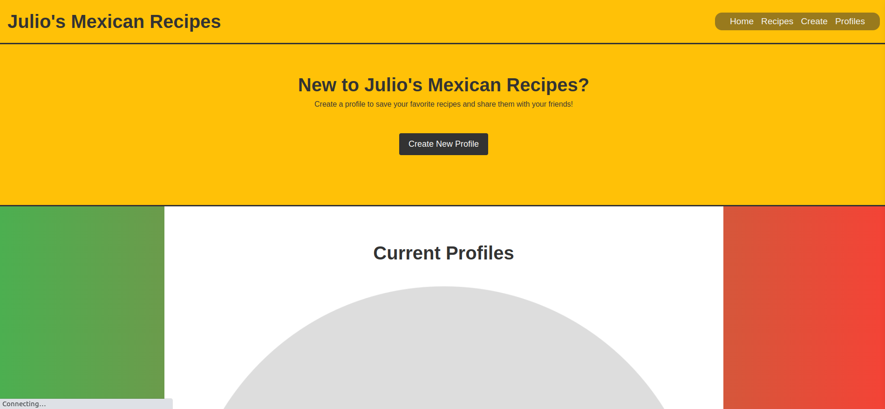

# "Julio's Mexican Recipes"
By: Nicolas Angel

<p align="center"></p>


# Project Description

Looking to add some spice to your cooking routine? Look no further than Julio's Mexican Recipes - a dynamic, user-friendly MEN stack application built with EJS, MongoDB, Javascript, and CSS.

This comprehensive recipe app is designed to inspire users to create delicious, authentic Mexican dishes by providing access to a database of recipes. With a personal profile, users can easily browse and save recipes for later use, as well as upload, edit, and delete their own recipes.

But the real magic of Julio's Mexican Recipes lies in its community features. With the ability to share recipes and connect with other users, this app offers a unique platform for foodies, home cooks, and anyone looking to explore the rich culinary heritage of Mexico.

With a sleek, intuitive user interface and robust back-end functionality, Julio's Mexican Recipes is the perfect app to elevate your cooking game and connect with a community of fellow food lovers. So why wait? Sign up today and start exploring the flavors of Mexico!


# Installation instructions

* Clone this repo down to your local machine!
* Make an `.env` File and add a mongoDB connection
* Run the following in the terminal...
```
npm i
```
* Then run the following command to launch it from a local server... 
```
npx nodemon
```
* In a browser, open what ever port was specified in the terminal and feel free to browse "Julio's Mexican Recipes"
    
    
# How to browse "Julio's Mexican Recipes"

DISCLAIMER: "Julio's Mexican Recipes" is a work on progress, it will be updated and these pictures may be outdated!

This is the Home page, where you can browse featured recipes and explore the about me.
<p align="center"></p>

This is the Index page, where you can explore all the recipes available.
<p align="center"></p>

This is the Create Recipe page.
<p align="center"></p>

This is the Profile page, where you can view profiles and create your own.
<p align="center"></p>


# List of the Technologies used

* EJS
* JavaScript
* MONGODB
* Express
* Visual Studio Code
* Heroku
* CSS
* HTML5
* Node
 
 
<!-- # User Stories
 
   As a Customer, I want to see what this SE stands for, so that I can decide if he is the right person to work with.

   As an Potential Employer, I want to see what this SE work is like, so that I can decide if he has the skills the company is looking for.

   As a Colleague, I want to see what this SE contact information is, that way I can add him on LinkedIn. -->
 
 
# Wireframes

These were my proposed Wireframes for "Julio's Mexican Recipes". They include features I would like to add and a basic layout of what the app would look like.

This is the wireframe for the Route table.
<p align="center"></p>

This is the wireframe for the Home page, where you can browse featured recipes and explore the about me.
<p align="center"></p>

This is the wireframe for the Index page, where you can explore all the recipes available.
<p align="center"></p>

This is the wireframe for creating a Profile page.
<p align="center"></p>

The full file below:
   [Project 2 Wireframe and Route Table.odp](https://github.com/nangel42/Men-Stack-Application/files/11032463/Project.2.Wireframe.and.Route.Table.odp)

<!--  
 # Major Hurdles
 
 *  -->
 
 
 # Next Steps
 
 * Updating the degin and layout of "Julio's Mexican Recipes".
 * Updating the login page to a more secure version.
 * Adding a favorites tab for individual users.
 
 
 # Credits
 
**Nicolas Angel**

* Links:

  <p align="left">
  	<a target="_blank" rel="noopener noreferrer" href="https://github.com/nangel42"></a> 
  	<a target="_blank" rel="noopener noreferrer" href="https://www.linkedin.com/in/nicolasangel/"></a> 
  	<a target="_blank" rel="noopener noreferrer" href="https://nangel42.github.io/Nicolas-Angel-Portfolio/"></a> 
  </p>

